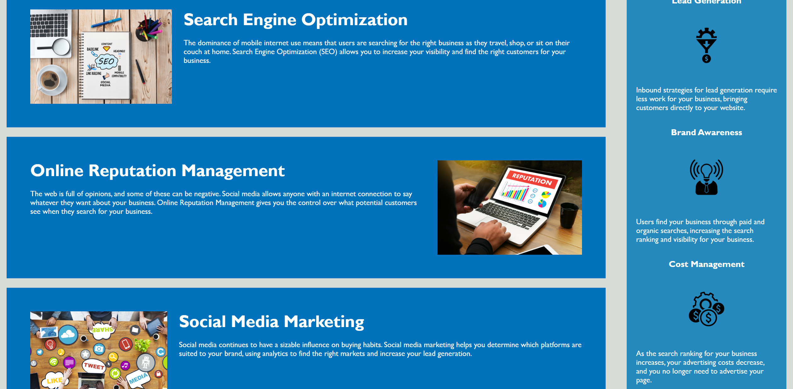

# <Search-Engine-Optimization-Project->

## Description

This project involved refactoring an exisiting 
website to make it follow best pactice and making it 
more accessible. 
I changed existing code in VS code and used HTML and 
CSS. i naviagted GitHub and created a repository 
where i made a unique name and deployed my work.

## Credits

Majority of my work was helped through watching the 
lectures and going over a few youtibe videos and 
using Ask BCS. To create my read me i used https://
coding-boot-camp.github.io/full-stack/github/
professional-readme-guide as a refrence point.

